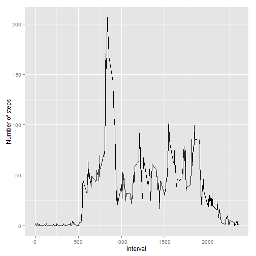
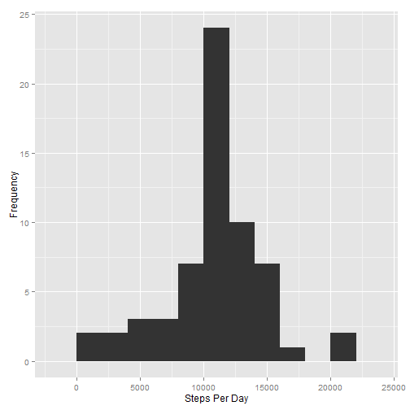
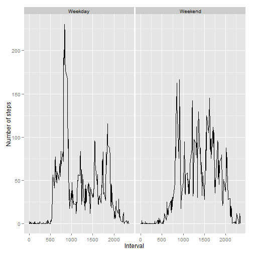

# Reproducible Research: Peer Assessment 1


## Loading and preprocessing the data

```r
## Import & Processing
library(plyr)
library(ggplot2)
# list.files() unzip('activity.zip') list.files()
initial = read.csv("activity.csv", nrows = 400, na.strings = "NA")
classes = sapply(initial, class)
a = read.csv("activity.csv", colClasses = classes)
a$date = as.Date(a$date, "%Y-%m-%d")
```


## What is mean total number of steps taken per day?

```r
## Mean & Median Histogram
a.1 = a[complete.cases(a), ]
a.1 = ddply(a.1, .(date), summarize, sum = sum(steps))
q.1 = qplot(sum, data = a.1, binwidth = 2000, xlab = "Steps Per Day", ylab = "Frequency")
print(q.1)
```

 

```r
mean.steps = mean(a.1$sum)
print(c("Average number of steps:", mean.steps))
```

```
## [1] "Average number of steps:" "10766.1886792453"
```

```r
median.steps = median(a.1$sum)
print(c("Median number of steps:", median.steps))
```

```
## [1] "Median number of steps:" "10765"
```


## What is the average daily activity pattern?

```r
a.2 = ddply(a, .(interval), summarize, mean(steps, na.rm = TRUE))
names(a.2) = c("interval", "meansteps")
g.1 = ggplot(a.2, aes(interval, meansteps))
g.1 = g.1 + geom_line() + xlab("Interval") + ylab("Number of steps")
print(g.1)
```

 

```r

## Interval with Highest Average Number of Steps
max.meansteps = max(a.2$meansteps)
print(c("Highest Average Number of Steps per 5-minute interval:", max.meansteps))
```

```
## [1] "Highest Average Number of Steps per 5-minute interval:"
## [2] "206.169811320755"
```

```r

## Count of Missing Values
bad = is.na(a$steps)
num.NAs = length(bad[bad == TRUE])
```


## Imputing missing values

```r
## Impute New Values
impute = function(x) replace(x, is.na(x), mean(x, na.rm = TRUE))
a = ddply(a, ~interval, transform, steps = impute(steps))
a = a[order(a$date), ]

## Histogram with Imputed Values
a.3 = ddply(a, .(date), summarize, sum = sum(steps))
q.2 = qplot(sum, data = a.3, binwidth = 2000, xlab = "Steps Per Day", ylab = "Frequency")
print(q.2)
```

 

```r

## Mean & Median with Imputed Values Mean & Median are equal because of
## method used to impute values: Take the mean of intervals and assign that
## to NA values
mean.steps.imputed = mean(a.3$sum)
print(c("Average number of steps, after imputation:", mean.steps.imputed))
```

```
## [1] "Average number of steps, after imputation:"
## [2] "10766.1886792453"
```

```r
median.steps.imputed = median(a.3$sum)
print(c("Median number of steps, after imputation:", median.steps.imputed))
```

```
## [1] "Median number of steps, after imputation:"
## [2] "10766.1886792453"
```

```r

## Weekday vs Weekend Differences
a$weekday <- as.factor(ifelse(weekdays(a$date) %in% c("Saturday", "Sunday"), 
    "Weekend", "Weekday"))

## Plot of Average # of steps per interval, Weekdays vs. Weekends
a.4 = ddply(a, .(interval, weekday), summarize, mean(steps))
names(a.4) = c("interval", "weekday", "meansteps")
g.2 = ggplot(a.4, aes(interval, meansteps)) + geom_line() + facet_grid(. ~ weekday) + 
    xlab("Interval") + ylab("Number of steps")
print(g.2)
```

 

## Are there differences in activity patterns between weekdays and weekends?
##Print Plots to Files

```r
dev.off()
```

```
## null device 
##           1
```

```r

png("plot1.png")
print(q.1)
dev.off()
```

```
## null device 
##           1
```

```r

png("plot2.png")
print(g.1)
dev.off()
```

```
## null device 
##           1
```

```r

png("plot3.png")
print(q.2)
dev.off()
```

```
## null device 
##           1
```

```r

png("plot4.png")
print(g.2)
dev.off()
```

```
## null device 
##           1
```

